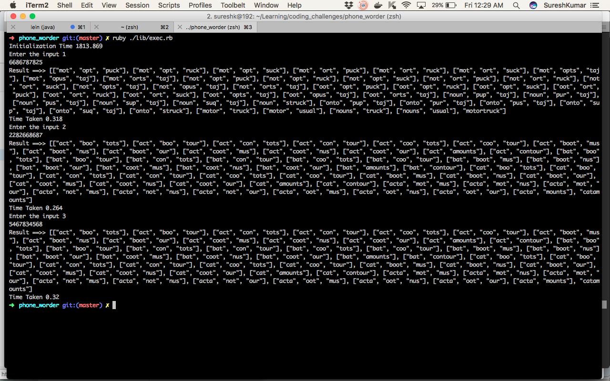

# PhoneWorder

## Running the app

* Use ruby version 2.4.3

* Go to the project folder and run `bundle install`

* Run `ruby ./lib/exec.rb`

* Enter the 10 digit mobile number

* Then the result will be printed

## Running the spec

* Run `rspec` from the project folder

## Approach

* When the app starts, for each words in the dictionay corresponding numbers will be calucalated and saved in a map. This will avoid finding the word combinations for numbers every time we needed.

* Then the program will split the provided phone number based on the minimum word 
  length and recursively calculates the words combination.

## Benchmark 

* The dictionary initialization took 1813.869 sec since it will index all the words.

* After the initialization, tried with three inputs.Each took 300 sec on average

    input1 => 0.318 sec
    input2 => 0.264 sec
    input3 => 0.320 sec

* Please find the details in the attached image    

